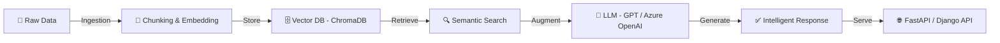

<div align="center">

<!-- Animated Header -->


<!-- Typing SVG -->
<a href="https://git.io/typing-svg">
  
</a>

<br/>

<!-- Profile Views & Social Badges -->
<p>
  
  <a href="https://www.linkedin.com/in/yassineghilani/">
    
  </a>
  <a href="https://ghilaniyassine.tech/">
    
  </a>
  <a href="mailto:ghilaniyassine11@gmail.com">
    
  </a>
</p>

</div>

---

## 🧠 Who Am I?

```python
class YassineGhilani:
    def __init__(self):
        self.name         = "Yassine Ghilani"
        self.role         = "AI Engineer & Full-Stack Developer"
        self.location     = "Tunisia 🇹🇳"
        self.education    = "BSc Computer Science — ISITCOM Sousse"
        self.website      = "https://ghilaniyassine.tech"

    @property
    def focus_areas(self):
        return [
            "🤖 Large Language Models (LLMs)",
            "📚 Retrieval-Augmented Generation (RAG)",
            "🕸️  Agent Orchestration & Multi-Agent Systems",
            "🌐 NLP Applications & Semantic Search",
            "☁️  Azure AI & Cloud-Native Solutions",
            "⚙️  Backend APIs with Django & FastAPI",
        ]

    @property
    def current_mission(self):
        return "Turning cutting-edge AI research into real-world impact."

    def fun_fact(self):
        return "When not training models, I'm training on the 🏀 basketball court!"
```

---

## 🚀 Tech Arsenal

### 🤖 AI / ML / LLM Stack
<p>
  
  
  
  
  
  
  
  
  
</p>

### 💻 Languages & Frameworks
<p>
  
  
  
  
  
  
  
  
</p>

### ☁️ Cloud & Databases
<p>
  
  
  
  
  
</p>

### ⚙️ DevOps & Tools
<p>
  
  
  
  
  
</p>

---

## 📊 GitHub Analytics

<div align="center">

<a href="https://github.com/ghilaniyassine">
  
  
</a>

</div>

<div align="center">
  
</div>

<br/>

<div align="center">
  
</div>

---

## 🏆 GitHub Trophies

<div align="center">
  
</div>

---

## 🎯 Core Expertise

<div align="center">

| Domain | Skills |
|--------|--------|
| 🤖 **Generative AI** | LLM Fine-tuning, Prompt Engineering, RLHF, RAG Pipelines |
| 🕸️ **Agent Systems** | Multi-Agent Orchestration, Tool Use, Memory Management |
| 📚 **NLP** | Semantic Search, Text Classification, Named Entity Recognition |
| ☁️ **Azure AI** | OpenAI Service, Cognitive Services, Azure ML, AI Search |
| ⚙️ **Backend** | RESTful APIs, Microservices, WebSockets, Async Pipelines |
| 🚀 **Deployment** | Docker, CI/CD, Cloud-Native, Scalable Architectures |

</div>

---

## 🌍 What I'm Building



> Building production-grade RAG systems, intelligent agents, and NLP pipelines that bridge research and real-world value.

---

## 📈 Contribution Heatmap

<div align="center">
  
</div>

---

## 🎓 Certifications & Learning

- 🏅 **Microsoft Azure AI** — Azure AI Services & Solutions
- 🤖 **LLM Engineering** — RAG, Fine-Tuning & Agent Orchestration
- 📊 **ML & Deep Learning** — PyTorch, TensorFlow pipelines
- 🌐 **Backend Mastery** — Django, FastAPI, REST API design

---

## 🤝 Let's Collaborate

> I'm open to collaborating on **AI research**, **LLM applications**, **RAG systems**, and **open-source NLP projects**.

<div align="center">

[](https://www.linkedin.com/in/yassineghilani/)
[](https://ghilaniyassine.tech/)
[](mailto:ghilaniyassine11@gmail.com)

</div>

---

<div align="center">

<!-- Snake animation -->
<picture>
  <source media="(prefers-color-scheme: dark)" srcset="https://raw.githubusercontent.com/ghilaniyassine/ghilaniyassine/output/github-contribution-grid-snake-dark.svg"/>
  <source media="(prefers-color-scheme: light)" srcset="https://raw.githubusercontent.com/ghilaniyassine/ghilaniyassine/output/github-contribution-grid-snake.svg"/>
  
</picture>

</div>

<!-- Footer Wave -->


<div align="center">
  <em>✨ Always curious. Always building. Always learning. ✨</em>
</div>
