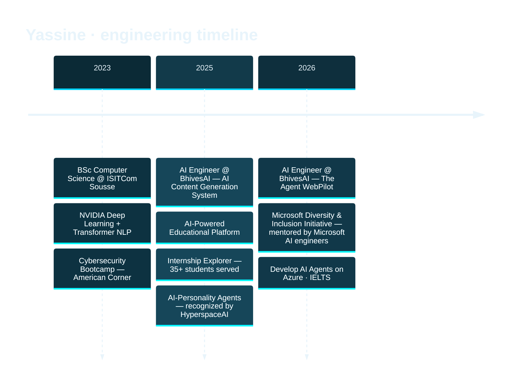
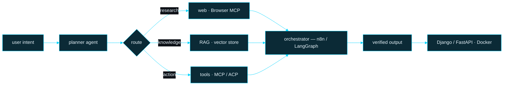

<div align="center">

<!-- ══════════════ HERO : hand-built animated pixel portrait ══════════════ -->


<br/>

<a href="https://ghilaniyassine.tech/">
  
</a>

<p>
  <a href="https://www.linkedin.com/in/yassineghilani/"></a>
  <a href="https://ghilaniyassine.tech/"></a>
  <a href="mailto:ghilaniyassine11@gmail.com"></a>
  <a href="https://github.com/GhilaniYassine?tab=repositories"></a>
  
</p>

</div>

---

## 🧠 `whoami`

```python
class YassineGhilani:
    """AI Engineer — I build agents that do the boring work for humans."""

    name      = "Yassine Ghilani"
    role      = "AI Engineer @ BhivesAI (Amsterdam, NL)"
    based_in  = "Sousse, Tunisia 🇹🇳 — remote-first"
    studying  = "BSc Computer Science @ ISITCom Sousse (2023 → now)"
    site      = "https://ghilaniyassine.tech"

    stack = {
        "agents":     ["n8n", "LangGraph", "MCP", "ACP", "OpenClaw", "AutoGen", "Semantic Kernel"],
        "ai":         ["Python", "PyTorch", "RAG", "NLP", "Computer Vision", "Ollama", "LLMs"],
        "cloud":      ["Azure AI Foundry", "Azure ML", "Microsoft Agent Service"],
        "backend":    ["Django", "DRF", "FastAPI", "PostgreSQL", "Docker", "Airtable"],
        "shipping":   ["Git", "GitHub Actions", "docker-compose", "Vercel", "Netlify", "Linux"],
    }

    def currently(self):
        return [
            "🤖 orchestrating multi-agent systems that drive real browsers",
            "🔁 turning manual workflows into n8n + LLM automation",
            "📚 deepening Azure AI Foundry & agentic frameworks",
            "🎤 teaching people to build their first AI agent (GDG On Campus)",
        ]

    def open_to(self):
        return "AI engineering roles · agentic-AI collabs · open-source"
```

---

## 🖼️ `render --portrait --mode=ascii`

<div align="center">

> _every pixel below is my actual photo, resampled and printed as characters_

</div>

```


                                          ==--  =
                              =#@@@@@@@%%@@@@@@@@@@*~
                            *@@@@%%@@@@@@@@@%%%%%@@@@@@@%*+~~++~
                          #@@@@@%%%@@@@@%%@%%%@@@%%@@@%%@@%+~~~+#
                       =%@@@@@%#%%@@@@@%##%@@@%@%%#%%%#%@@@@@@#++%
                     +@@@@@@@%%@@@@@@@@@%%%%#%%%%%%#########%%@@@@%~
                   #@@@@@@@@@@@%%@@@@@@@@@%%%@@@@@@@@@@%%@%##%%%@@@@#+
                 +@@@@@@@@@@@@@%%%##*++++*+=-~==+****#%@@@@%####%@@@@@=
                 #@@@@@@@@@@@@@@#=-:'''''''.........'.'~=%@@@%#%%@@@@#=
                 #@@@@@@@@@@@@@#~-''''::::'''''''''...  .'+@@@@%@@@@@@#
                 %@@@@@@@@@%##*=~-:::::--:::::::'''.... ...#@%%%#@@@@@@
                 -@@@@@@@@@+++=~~-:::::--:::::::::'......''=@@@@%%@@@@%
                 +@@@@@@@@#=+~---:::::::-:::::::'''....  ..'%@@@@@@@@@#
                 ~@@@@@@@%=-::::'''....'''::'''........     ~@@@@@@@@%
                  *@@@@@@+:~+#%%%##**=-'''''''-+*#######+~:  +@@@@@@@=
                   %@@@@%-=#+~~=+**#%%#~:::'':=++=~~~-:.':~-  *@@@@@@-
                   *@@@@=:-:-=++###%%%##=-:. .'-=*##*+=~:     :@@@@@%~
                   @#~%%:--~*%%++@@#*@@%*-'  .:*@%%@@=-#*~'    *@%+**
                   +#=%+:---~~====+****+~:'  .'~*#*+=-::'''... ~%-.=~
                    ~#%=----::::--~~~~~~~-'    .'---:''.....'..'=#~'
                     =*+~~--::::::::-~==~~:.  ....'''''''.....'-==:
                      =+=~~~~--:::--~+=~~-:   .'::'':''''''.'':-::
                       ~===~~~--:---=+=+=-'. '-':::::''''''''::::
                         +==~~-----~-=#%%=~~:~~:'::::'''''''::'
                         ===~~-~~~~~~~~==-=+:'''''':''''''':::
                          =~~~~~==+******+===~~--~=~:''''''':'
            +#%%%%#+~     :=~~~~==**+++++=++~-~~~=*+~:'''.':'
          #@@@@@@@@@@@@@@%#=========~~~-~===~:'''::--:'''''':
         +@@@@@@@@@@@@@@@@@-~=+==~====~~~=~~~---:-::''::::..@@@%*****#####**=
         %@@@@@@@@@@@@@@@@@~-~=+++=~~~~~---:'':'...':-::'. :@@@@@@@@@@@@@@@@@@
        *@@@@@@@%%%%@@@@@%+~---~=+**+++=~--~~--------:'..  ~@@@@%%%@@@@@@@@@@@
       *@@@@@%%%@@%%@@@@%*=~---~~~=+***#*++===~---::'''.   ~@@@@%%%%@@@@%%%@@@+
      +@@@@@@@%%%%@@@@@#**+~----~~~==++**+~::::''''''..    ~@@@@@@@@@@%###%%@@@+
    %@@@@@@@%%%%%%%%@@@#*+==~~~----~~===+=~-::'''''....   .+@@@@@@@%######%%@@@=
 =*%@@@@@@@@%%%%%%%%%%@@%#+=~==~~~--~~~----:''.........'':~%@@@@%%########%@@@@@=
@@@@@@@@@@@%%%%%%%%%%@@@@@%*======~~----:''''...'''':----~#@@@%%########%%%%%@@@%+
@@@@@@@@@@@@@%%%%%%%%%%@@@@@@%##*+=~~~~--:::::::--~+**##%@@@%%%%##########%%@@@@@@@@
%%%%%%%%%%%@@@@@@%%%%@%%%%%%@@@@@@%#+~~~~====++*#%@@@@@@@@%%#%%#####%%%%%%%%%%%@@@@@
%%%%%%%%%%%%%%%%%%@@@@@@@@#*#%@@@@@@@@%#+~~+#%@@@@@@@@@%@%#%%%%%%%%@%%%%%%%%%%%%%%%%
%%%%%%%%%%%%%%%%%%%%%@@@@@@**#@@@@%%@@@@@@@@@@@@@@@@@@%###@%%#%%##%%##%%##%%%%%%%%#%
%%%%%%%%%%%%%%%%%%%%%%%@@@@#**%@@@@@@%%%%%%%%%%%@@@@@@##*%%%##%##%%%###%##%%%%%%%##%
%%%%%%%%%%%%%%%%%%%%%%%%@@@%**#@@@@@@@@@%%%%%%%%%%%@@#**#@%##%%##%@%###%##%%%@%###%%
%%@%%%%%%%%%%%%%%%%%%%%%%@@%**#%%%%%%@@%%%%%%%%%%%@@@#**%%###%%#%%%%###%#%%%@%%##%%%
```

<details>
<summary><b>🔢 switch to binary mode — <code>render --portrait --mode=binary</code></b></summary>

```


                                          1010  1
                              00000000000000000000000
                            100000001000100010001000000010101010
                          000000000000000000000000000000000001010
                       0000000100000000000100000001000100000001010
                     00000000000000000000000000000000000000000000001
                   010001000100010000000000010000000000010001000100010
                 100000000000000000001000101010101000000000000000000000
                 000000000000000101111111111111111111111100000100000001
                 000000000000000010101010101010101110111010000000000000
                 000100010001010111111111111111111111111111000001000100
                 100000000000101010101010101010101011111110100000000000
                 000000000101011111111111111111111111111111100000000001
                 10000000001010101110111010101110111011111110000000000
                  1010000010100010101011111111101010101011111000100010
                   000000100010101000001010111000101010111011100000001
                   000001111101010100010101111111010101011111110000000
                   001000101000100000000011111000000010001011111000001
                   01010111011101010101011111110101011111111111011101
                    000101011101010101010101111111010101111111110001
                     0101011111111111010101111111111111111111111101
                      01010101010101000101011111010101010111010101
                       010101111111010101111111111111111111111111
                         10101010101010001010101110101011101010
                         0101011101110101010111111111111111111
                          010101010000000001010101010101011101
            100010101     10111010101010101011101010111111111
          000000000000000001010101010101010101011101010111010
         00000000000000000011010101010101011101110111111111100001010101010101
         000000000000000000101010001010101010101011101010111000000000000000000
        1000100010001000001011101010101011101111111111111110000010001000000010
       000000000000000000101010101000100010101010101110111110000000000000000000
      10000000100000000010101011101010101011111111111111111000000000001010100000
    0000000000000000000000010101010101010001010101110111111100000000000000000001
 01000001000100010001000101010101110111011111111111111111110000010101010100010001
0000000000000000000000000000010101010101010111111101010101000000000000000000000001
000000000000000000000010000000101010101111111111101010100000001000100010001000000000
000000000000000000000000000000000000010101010000000000000000000000000000000000000000
100010001000100010001000101010001000000011101000000010001010101010001000100010001000
000000000000000000000000000000000000000000000000000000000000000000000000000000000000
001000100010001000100000000010100000001000100010000000101010101010000010001000100010
000000000000000000000000000000000000000000000000000000000000000000000000000000000000
100010001000100010001000100010101000100010001000100010101010100010001010100010101000
```

</details>

---

## 🧭 Experience



<table>
<tr>
<td width="50%" valign="top">

### 🟦 AI Engineer — [BhivesAI](https://bhives.ai/)
`Jan 2026 → Apr 2026` · Amsterdam, NL

**The Agent WebPilot** — multi-agent AI that drives a real browser from a plain-English request.

- Designed a multi-agent system automating live browser tasks
- Built the orchestration pipeline on **OpenClaw · OpenCode · ACP**
- Integrated **Browser MCP** for reliable real-time web interaction
- Containerized with **Docker**, versioned with **Git**

</td>
<td width="50%" valign="top">

### 🟦 AI Engineer — [BhivesAI](https://bhives.ai/)
`Sep 2025 → Nov 2025` · Amsterdam, NL

**AI Content Generation System** — ideas in, publish-ready social content out.

- Built an automation platform on **n8n** turning ideas into posts
- Designed multi-agent workflows: copy, image gen, smart web research
- Shipped an **Airtable** control panel + backend↔frontend integration
- **Python · n8n · Airtable · Docker · Ngrok · GitHub** in production

</td>
</tr>
</table>

---

## 🚀 Projects

<div align="center">

| Project | What it does | Stack |
|:--|:--|:--|
| **🎓 AI-Powered Educational Platform** | Full LMS with secure auth, role-based dashboards, subject-level permissions and an AI assistant for interactive learning + quizzes. Optimized Dockerfile layer caching. | `Django` `DRF` `Gemini AI` `PostgreSQL` `Docker Compose` |
| **🧭 Internship Explorer** | Automates internship discovery with ETL pipelines and workflow automation — **35+ university students** find and filter opportunities with it. | `n8n` `Airtable` `Python` `ETL` |
| **💬 AI-Personality Agents** | WhatsApp chatbot with multiple specialized agents, context-aware conversation switching and RAG knowledge retrieval — **recognized by HyperspaceAI**. | `Python` `RAG` `Vectorize` `n8n` `LLMs` |

</div>

---

## 🧰 Tech Arsenal

<div align="center">

**🤖 AI · Agents · LLMs**


**🌐 Web · Backend · Data**


**⚙️ Automation · Ops**


</div>

---

## 🏗️ How I build agentic systems



---

## 📊 GitHub in numbers

<div align="center">


</div>

---

## 🎓 Certifications & Training

<div align="center">

| 🏅 | Credential | Issuer · Year |
|:--:|:--|:--|
| ☁️ | [**Develop AI Agents on Azure**](https://learn.microsoft.com/en-us/users/ghilaniyassine-4861/achievements/fqe8nfmx) — Foundry Agent Service & Microsoft Agent Framework | Microsoft Learn · 2026 |
| 🗣️ | **IELTS** — English proficiency | British Council · 2026 |
| ☁️ | **Introduction to AI in Azure** | Microsoft Learn · 2025 |
| 🧠 | [**Fundamentals of Deep Learning**](https://www.linkedin.com/in/yassineghilani/details/certifications/) — architectures & GPU-accelerated training | NVIDIA |
| 🔤 | **Transformer-Based NLP** — attention & transformer architectures | NVIDIA · 2023 |
| 🔧 | **AI for Predictive Maintenance** — fault detection & anomaly recognition | NVIDIA · 2023 |
| 🐙 | **GitHub Foundations** — Git internals & collaborative workflows | DataCamp · 2023 |
| 🔐 | **Cybersecurity Bootcamp** — threat assessment & security implementation | American Corner Sousse · 2023 |

</div>

> 🎯 **Microsoft Diversity & Inclusion Initiative** — mentored by senior Microsoft AI engineers on building and deploying AI solutions with **Azure ML** and **AI Foundry**, and on agentic frameworks such as **Semantic Kernel** and **AutoGen**.

---

## 🎤 Teaching & Community

- **AI Agent Workshop** — *GDG On Campus, EPI Digital School Sousse.* Led a hands-on session where every participant built their first AI agent from scratch → [workshop recap](https://ghilaniyassine.tech/workshop)
- **Computer Science Mentor** — *American Corner Sousse.* Taught programming and problem-solving to high-school students.

---

## 🌍 Languages

<div align="center">

| Language | Level | Proficiency |
|:--|:--|:--|
| 🇹🇳 **Arabic** | Mother tongue | `██████████` |
| 🇬🇧 **English** | C1 listening & speaking · B2 reading & writing | `████████──` |
| 🇫🇷 **French** | B2 · B1 writing | `██████────` |

</div>

---

## 🐍 Watch my contributions get eaten

<div align="center">

<picture>
  <source media="(prefers-color-scheme: dark)" srcset="https://raw.githubusercontent.com/GhilaniYassine/GhilaniYassine/output/github-snake-dark.svg"/>
  <source media="(prefers-color-scheme: light)" srcset="https://raw.githubusercontent.com/GhilaniYassine/GhilaniYassine/output/github-snake.svg"/>
  
</picture>

<br/><br/>


</div>

---

<div align="center">

## 💬 Let's build something that thinks

Open to **AI engineering roles**, **agentic-AI collaborations** and **open-source** work.

<a href="mailto:ghilaniyassine11@gmail.com"></a>
<a href="https://www.linkedin.com/in/yassineghilani/"></a>
<a href="https://ghilaniyassine.tech/"></a>


<sub>The portrait up top is my actual photo, re-rendered by <a href="tools/portrait_to_svg.py"><code>tools/portrait_to_svg.py</code></a> into <b>2,459</b> hand-placed rectangles — <code>assets/hero.svg</code> carries no image data at all.</sub>

</div>
